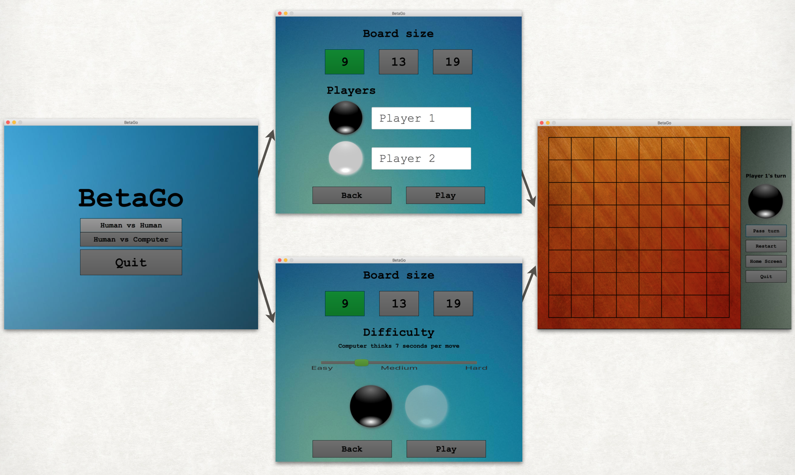

# BetaGo

## Compilation and running

```javascript
git clone https://github.com/thomas1242/BetaGo/     
find ./BetaGo/src/go/* | grep .java > argfile
javac @argfile
java -cp BetaGo/src/ go.Main 

```


